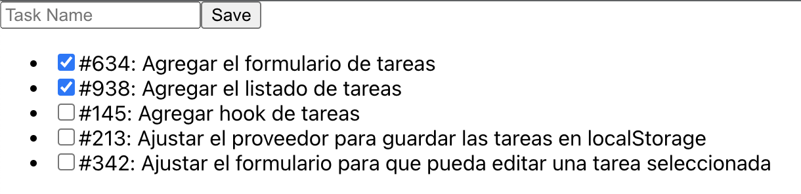

# Lista de tareas en React

## Prerequisitos

- Conocimientos básicos de React
  - Componentes
  - hooks

## Objetivos

- Crear una aplicación web en React para guardar un listado de tareas

## Laboratorio

### Instalación

1. Instala [Node.js](https://nodejs.org/en/)
1. Clona este repositorio
1. Instala las dependencias usando usando el comando `npm install`
1. Inicia la aplicación usando el comando `npm run start`

### Formulario de tareas

Para poder editar/crear tareas crearemos un componente, lo haremos por medio de un elemento `form`.

1. Crea un componente `TaskForm` en la carpeta de `components` con el siguiente contenido:

```javascript
import { useState } from "react";
import { useTasks } from "../hooks/useTasks";

export const TaskForm = () => {
  const [task, setTask] = useState({ name: "", isCompleted: false });

  const handleChange = (e) => {
    const inputName = e.target.value;
    setTask({ ...task, name: inputName });
  };

  const handleSave = () => {
    // TODO
  };

  return (
    <form>
      <input
        type="text"
        placeholder="Task Name"
        value={task.name}
        onChange={handleChange}
      />
      <button type="button" onClick={handleSave}>
        Save
      </button>
    </form>
  );
};
```

1. Importa e incluye tu nuevo componente en tu aplicación, para esto edita el archivo `App.js`

   ```javascript
   import { TaskForm } from "./components/TaskForm";

   function App() {
     return (
       <section>
         <TaskForm />
       </section>
     );
   }

   export default App;
   ```

### Lista de tareas

Para poder listar las tareas creadas crearemos 2 components, un `TaskItem` y un `TaskList`

1. Crea un componente llamado `TaskItem` en la carpeta `components`, este componente debe recibir las siguientes propiedades:
   - `id`
   - `isChecked`
   - `taskName`
   - `onTaskChange`: Este callback le informará al padre cuando se hizo click sobre la tarea
1. Usando tus conocimientos de componentes en React, con base en la siguiente estructura HTML y en las propiedades, crea un componente reusable para poder mostrar una tarea

   ```html
     <li>
       <label>
        <input type="checkbox" onChange={onTaskChange} />
        <span>#1: Nombre de la tarea<span>
       </label>
     </li>
   ```

1. Crea un componente `TaskList` que contendra una lista de componentes `TaskItem`, este componente no recibirá ninguna propiedad ya que hará uso del hook para leer el listado de tareas almacenado
1. Usando tus conocimientos de componentes en react y con base en la siguiente estructura HTML, crea un componente reusable para poder mostrar la siguiente lista de tareas

   ```javascript
   export const initialTasks = [
     {
       id: "634",
       isCompleted: true,
       name: "Agregar el formulario de tareas",
     },
     {
       id: "938",
       isCompleted: true,
       name: "Agregar el listado de tareas",
     },
     {
       id: "145",
       isCompleted: false,
       name: "Agregar hook de tareas",
     },
     {
       id: "467",
       isCompleted: false,
       name: "Ajusta tus componentes para que usen el hook 'useTasks'",
     },
     {
       id: "213",
       isCompleted: false,
       name: "Ajustar el proveedor para guardar las tareas en localStorage",
     },
     {
       id: "342",
       isCompleted: false,
       name: "Ajustar el formulario para que pueda editar una tarea seleccionada",
     },
   ];
   ```

   ```html
   <ul>
     <TaskList />
     <TaskList />
     <TaskList />
   </ul>
   ```

   > NOTA: puedes usar iteradores (`map`) para poder renderizar una lista de componentes con base en una lista de tareas, no olvides adicionar la propiedad [key](https://reactjs.org/docs/lists-and-keys.html#keys) para que React pueda seguir los cambios a la lista

1. Incluye tu componente en tu aplicación

   ```javascript
   ...
   function App() {
     return (
       <section>
         <TaskForm />
         <TaskList />
       </section>
     );
   }
   ```

1. En este punto tu aplicación debería verse similar a:

   

### Hook de tareas

Usaremos un hook para poder guardar las tareas, esto permitirá que en el futuro las tareas puedan ser guardadas no solo en memoria sino en `localStorage` o inclusive en un API remoto, todo sin cambiar nuestros componentes ya que esta lógica queda contenida dentro del hook. Para poder compartir la información almacenada en el hook con otros componentes de la aplicación usaremos el [Context API](https://reactjs.org/docs/context.html).

1. Crea una carpeta `hooks` en la carpeta `src`
1. Crea un archivo `useTasks` dentro de la carpeta `hooks`.
1. Crea un provider en el archivo `useTasks` que guarde una lista de tareas:

   ```javascript
   import React, { useContext, useState } from "react";

   export const initialTasks = [
     {
       id: "634",
       isCompleted: true,
       name: "Agregar el formulario de tareas",
     },
     {
       id: "938",
       isCompleted: true,
       name: "Agregar el listado de tareas",
     },
     {
       id: "145",
       isCompleted: true,
       name: "Agregar hook de tareas",
     },
     {
       id: "467",
       isCompleted: false,
       name: "Ajusta tus componentes para que usen el hook 'useTasks'",
     },
     {
       id: "213",
       isCompleted: false,
       name: "Ajustar el proveedor para guardar las tareas en localStorage",
     },
     {
       id: "342",
       isCompleted: false,
       name: "Ajustar el formulario para que pueda editar una tarea seleccionada",
     },
   ];

   const TasksContext = React.createContext();

   export const TasksProvider = ({ children }) => {
     const [tasks, setTasks] = useState(initialTasks);

     const value = { tasks, setTasks };

     return (
       <TasksContext.Provider value={value}>{children}</TasksContext.Provider>
     );
   };
   ```

   > NOTA: El provider es solo un componente que puede pasar información a sus hijos sin necesidad de pasarla por propiedades usando el Context API de React

1. En el mismo archivo crea un custom hook que permita leer y editar la lista de tareas desde otros componentes:

   ```javascript
   ...

   export const useTasks = () => {
     const context = useContext(TasksContext);

     if (!context) {
       throw new Error("useTasks must be used inside a TaskProvider");
     }

     const { tasks, setTasks } = context;

     const addTask = (newTask) => {
       setTasks([...tasks, newTask]);
     };

     const toggleTask = (taskId) => {
       setTasks(
         tasks.map((task) => {
           if (task.id === taskId) {
             return { ...task, isCompleted: !task.isCompleted };
           }
           return task;
         })
       );
     };

     return { tasks, addTask, toggleTask, setTasks };
   };
   ```

   > NOTA: Este hook tiene funciones adicionales `addTask` y `toggleTask` que facilitan la edición de las tareas

1. Para usar el hook en nuestros componentes debemos usar el proveedor y hacerlo un componente padre de nuestra aplicación, para esto edita el archivo App.js

   ```javascript

   ...
   <React.StrictMode>
    <TasksProvider>
      <App />
    </TasksProvider>
   </React.StrictMode>,
   ...

   ```

### Reutilización del hook dentro de los componentes

1. Ahora ajusta tu `TaskList` form para que lea la información de las tareas del hook

   ```javascript
   ...

   export const TaskList = () => {
     const { tasks } = useTasks();

   ...
   ```

1. Puedes borrar la variable `initialTasks` ya que ahora el listado se esta leyendo de la información del hook

1. Ahora ajusta tu `TaskList` form para que al dar click a una tarea esta pueda marcarse como completa, usando la funcion `toggleTask`, esta función recibe un `id` de una tarea para marcarla como completa

   ```javascript
     ...

     export const TaskList = () => {
       const { tasks, toggleTask } = useTasks();

     ...
   ```

1. Ajusta el task form para poder crear una nueva tarea, para esto puedes usar el metodo `addTask` del hook

### Ajustar la aplicación a nuevos requerimientos

Una lista de tareas que se pierde al recargar la página no es muy útil, por lo que ajustaremos la logica dentro del hook para poder guardar las tareas en `localStorage`

1. En el archivo `useTasks.js` borra la constante `initialTasks` ya que las tareas ahora vendrán del `localStorage`
1. Ajusta el provider para guardar las tareas en localStorage

   ```javascript
   ...

   const TASKS_LOCALSTORAGE_KEY = "tasks";

   export const TasksProvider = ({ children }) => {
     const initialTasks = JSON.parse(
       localStorage.getItem(TASKS_LOCALSTORAGE_KEY) ?? "[]"
     );
     const [tasks, setTasks] = useState(initialTasks);

     const value = {
       tasks,
       setTasks: (tasks) => {
         localStorage.setItem(TASKS_LOCALSTORAGE_KEY, JSON.stringify(tasks));
         setTasks(tasks);
       },
     };

     return (
       <TasksContext.Provider value={value}>{children}</TasksContext.Provider>
     );
   };

   ...

   ```

   > NOTA: puedes usar el operador `??` para verificar que no hay ningun elemento en localStorage con la llave `tasks` y asignar un valor por defecto, en este caso un array vacio en forma de string ya que se esta usando dentro de la función `JSON.parse`

1. Si creas una nueva tarea y recargas el navegador, tus tareas seguirán en el estado en el que las dejaste
1. Felicitaciones, has creado una aplicación de lista de tareas en React

### Añade estilo a tu aplicación

1. Define un estilo para un componente en el archivo `App.css`

```css
.task-item {
  padding: 1rem;
  border: solid 1px #dedede;
  background-color: white;
  border-radius: 4px;
  margin: 1rem;
  box-shadow: rgba(0, 0, 0, 0.1) 0px 4px 6px;
  list-style: none;
  font-size: 1.1rem;
}

.task-item label {
  display: flex;
  align-items: center;
}

.task-item input {
  margin-right: 0.4rem;
}

.task-item input {
  width: 20px;
  height: 20px;
}

.task-item input:checked {
  accent-color: green;
}
```

1. Asigna el estilo a tu componente usando la propiedad `className`

```javascript
export const TaskItem = (...) => {
  ...
  return (
    <li className="task-item">
  ...
```

1. Importa tus estilos en tu aplicación, `App.js`

```javascript
...
import "./App.css";
...
```

### Reto 💪

El nuevo requerimiento es poder actualizar tareas que ya se hayan creado, usa tus conocimientos y creatividad para ajustar el formulario y la lista de tareas para poder editarlas
